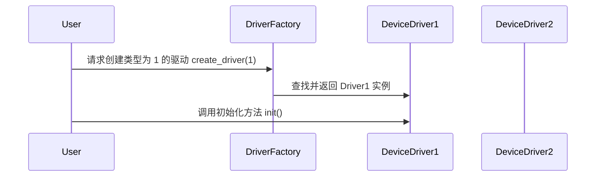
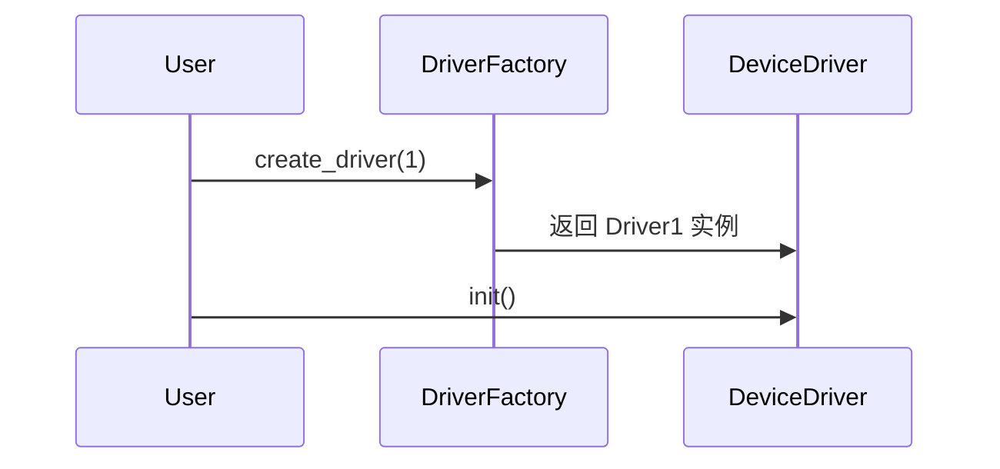

<h1>Lniux源代码使用到的创建模式例子</h1>

<h2>代码</h2>

```c
<h1>Linux源代码中运用的创建模式示例</h1>

<h2>代码</h2>

```c
#include <linux/module.h>
#include <linux/kernel.h>

// 设备驱动接口定义，包含初始化和退出函数指针
struct device_driver {
    void (*init)(void);
    void (*exit)(void);
};

// 设备驱动实现，分别定义了 driver1 和 driver2
static struct device_driver driver1 = {
    .init = driver1_init,
    .exit = driver1_exit
};

static struct device_driver driver2 = {
    .init = driver2_init,
    .exit = driver2_exit
};

// 设备驱动工厂函数，根据传入的类型创建对应的驱动实例
struct device_driver* create_driver(int type)
{
    switch (type) {
    case 1:
        return &driver1;
    case 2:
        return &driver2;
    default:
        return NULL;
    }
}

// 模块初始化函数，调用工厂函数创建驱动并初始化
static int __init my_module_init(void)
{
    struct device_driver* driver = create_driver(1);
    if (driver) {
        driver->init();
    }
    return 0;
}

// 模块退出函数，调用工厂函数创建驱动并执行退出操作
static void __exit my_module_exit(void)
{
    struct device_driver* driver = create_driver(1);
    if (driver) {
        driver->exit();
    }
}

module_init(my_module_init);
module_exit(my_module_exit);
```

<h2>UML类图</h2>



<h2>UML顺序图</h2>




